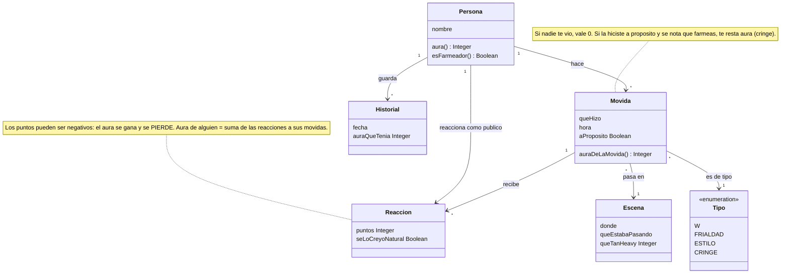
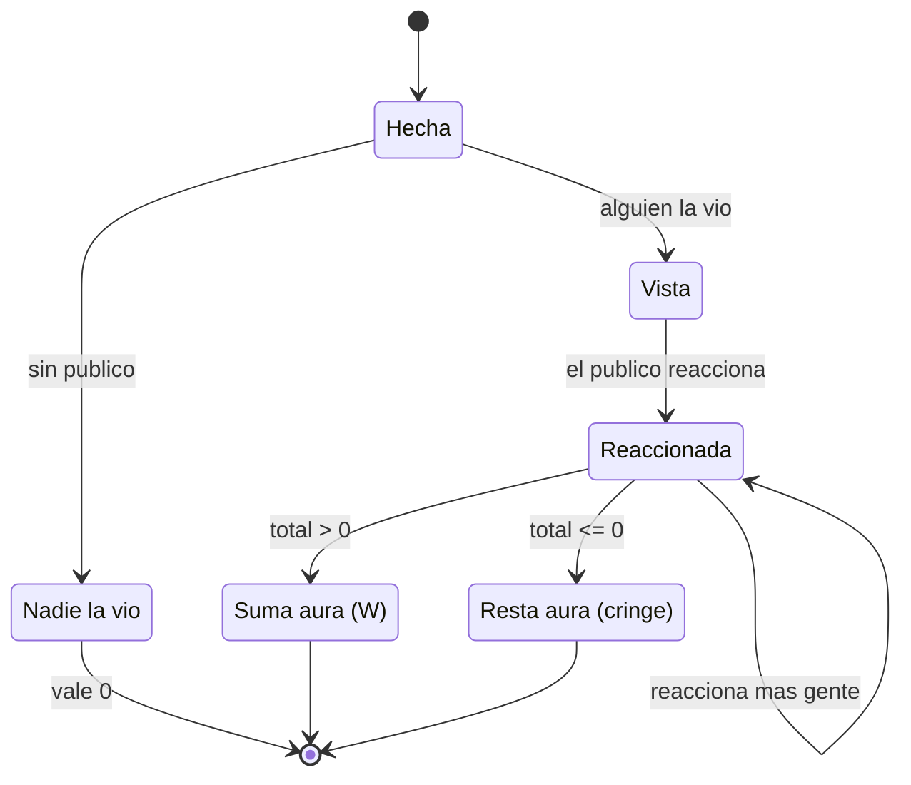
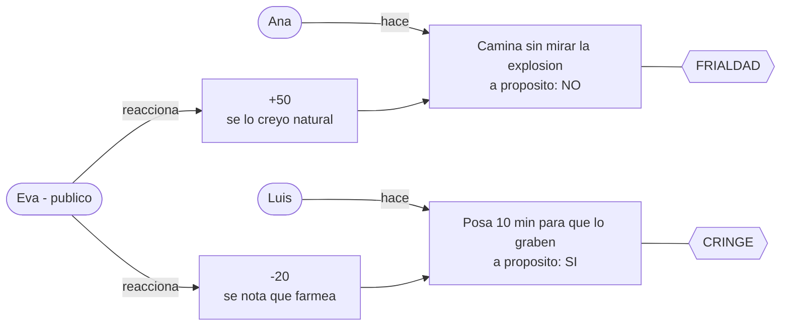

# Ingeniería del software I 

# Reto 001 - Modelado: Farmear aura

## Diagrama de clases

## ¿Qué pasa con una movida?

## Ejemplo: Ana vs Luis

## Glosario

| Término | Significa |
|---|---|
| **Aura** | Puntos de "presencia" que tienes. Pueden ser negativos. |
| **Farmear** | Hacer movidas a propósito para sacar aura. |
| **Movida** | Cosa que haces y que otros pueden ver. |
| **Reacción** | Lo que opina, en puntos, alguien que te vio. |
| **Escena** | El momento y lugar donde pasa la movida. |
| **W** | Movida que suma aura. |
| **Cringe** | Movida que resta aura. |

## Supuestos

1. Sin público no hay aura.
2. El aura no se guarda: se calcula sumando reacciones.
3. Puedes perder aura (quedarte en negativo).
4. No cuenta reaccionar a tus propias movidas.
5. Cada persona del público pone sus propios puntos.

## Decisiones discutibles

- **"A propósito" es un dato de la movida**, porque farmear es hacerlo con intención. Pero lo que cuenta es si el público se lo cree (`seLoCreyoNatural`): farmear de forma obvia da cringe.
- **La Escena va aparte**: la misma movida vale distinto según lo heavy que sea el momento (ignorar una explosión no es lo mismo que ignorar un mosquito).
- **Tipo es una lista** (W, frialdad, estilo, cringe) y no clases separadas, porque solo sirve para clasificar.
- **Reacción es una clase**, no una simple relación, porque tiene datos propios (puntos y si se lo creyó natural).
- **Quedan fuera**: redes sociales, que el aura se apague con el tiempo y el aura de grupos.
